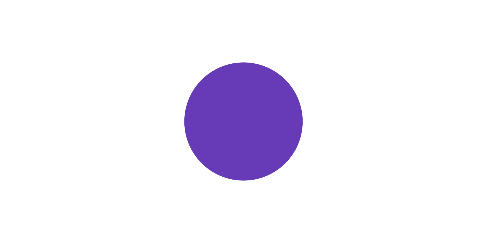
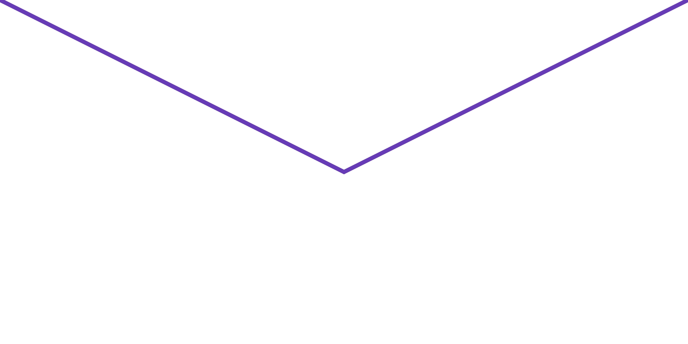
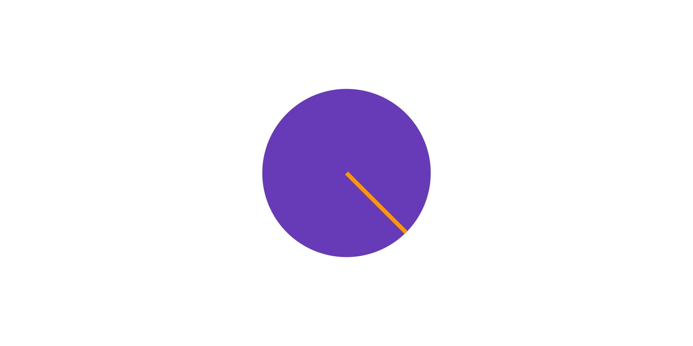
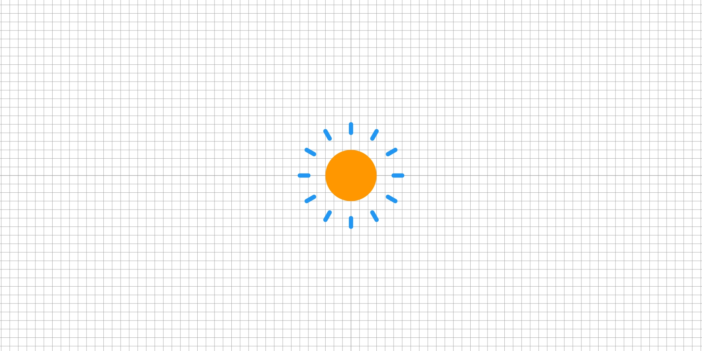
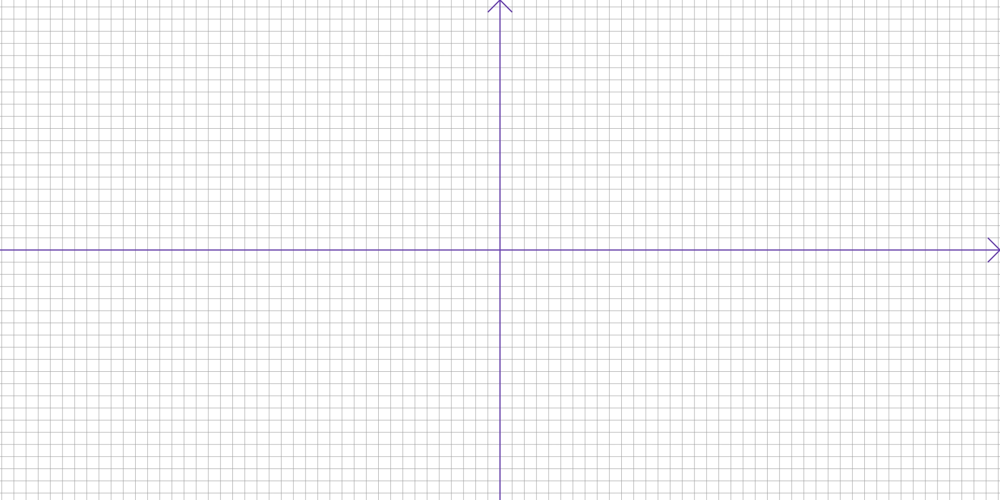

# learn_paint
Flutter 绘制学习

## 练习环境说明
每个demo放在一个fold下，每个fold有一个main文件，运行时，通过切换main来执行具体demo。

## 01
||
|:-:|
|[实现通过CustomPaint组件，使用Cavas API绘制一个圆。](lib/01_pure/paper.dart)|

## 02
Canvas Api初体验。
||||
|:-:|:-:|:-:|
|[线段](lib/02_canvas_api/paper.dart)|[填充形状](lib/02_canvas_api/paper.dart)|[线框形状](lib/02_canvas_api/paper.dart)|

## 03
Canvas Api基本使用。
||||
|:-:|:-:|:-:|
|[平移](lib/03_canvas/translate.dart)|[缩放与旋转](lib/03_canvas/scale.dart)|[坐标系](lib/03_canvas/coordinate.dart)|